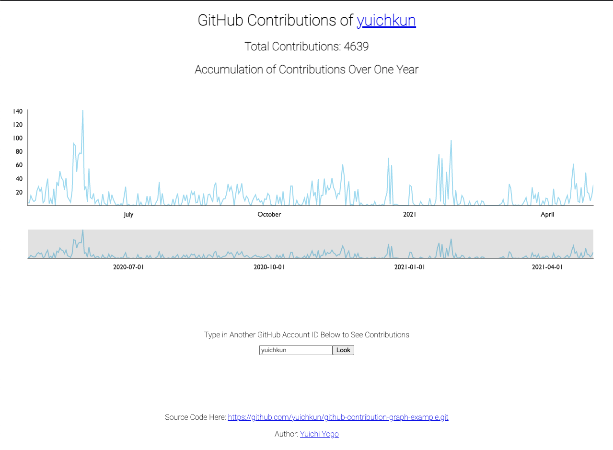

# Github Contribution Graph Example

## Description

This is just a repository to show how you can make use of the GitHub API to retrieve users contribution data.
The demo is built with Next.js and Vercel.

The source code is free of use, modification, or re-publication, commercially or otherwise.

## Working Demo

<https://github-contribution-graph-example.vercel.app/>